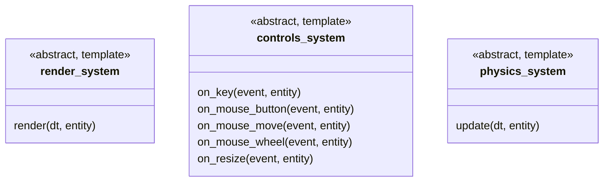
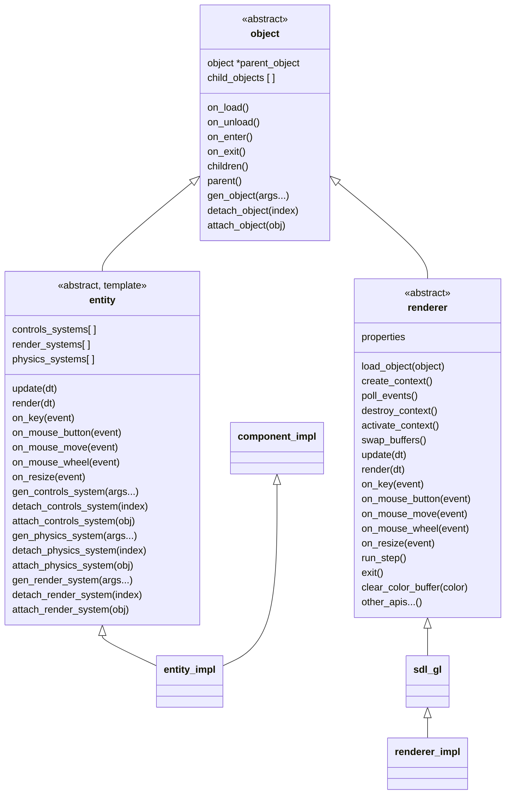
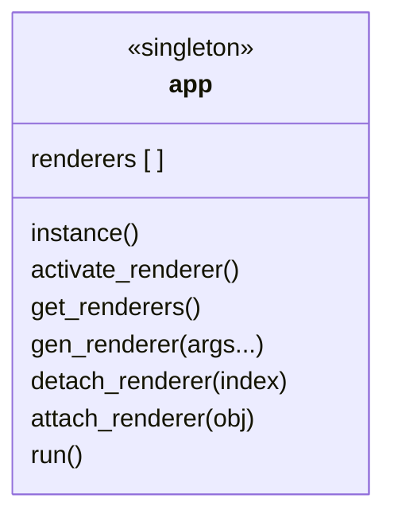

# Square - A Rendering Engine built for SQUINT

Square is a rendering engine meant to be used with the SQUINT linear algebra library to create 3D and 2D simulations of physical systems.

Square provides a light abstraction over the core rendering APIs from OpenGL as well as a basic entity component system for modeling scenes of animated objects.

Along with the framework used to render scenes, square provides sets of standard meshes, materials, components, systems, and UI elements that you can use to create your own renderable entities and scenes.

# Dependencies
Be sure to clone with submodules to get the SQUINT library as well as square.

```
git clone --recurse-submodules -j8 https://github.com/barne856/square
```

Along with the SQUINT library, you will need OpenGL 4.5 capable hardware, SDL2, SDL2_Image, and GLEW. SQUINT can be built with or without Intel MKL. You can build the sample applications using the included CMakeLists.txt.

# Overview
The code is internally documented in the header files and sample application files. The architecture of square is shown in the diagrams below:







The `app` class is a singleton class that is the root of the application hierarchy. The `app` class is structured as a tree which can contain one or more `renderer` objects which themselves contain trees of `objects`. Each `renderer` is itself an object as well as an implementation of a rendering API with user defined settings.

A `renderer` is responsible for loading a root object or scene. Only one scene per renderer can be active at a time. All active scenes and their objects are available for rendering by the application.

A scene is any entity that contains one or more `camera` entities. A scene can have more than one camera. For example, you may use a perspective projection camera to view the 3D objects in the scene and an orthographic projection camera to render UI elements overlayed on the screen.

You can render `entity`s using `material`s. A `material` represents a shader in OpenGL. All meshes that will be rendered by the material are child objects of that material.

All `entity`s in a scene are `object`s containing `systems` and inheriting from components. Components are classes that provide data and functions to operate on the data while `system`s are callbacks to rendering events such as a physics/rendering update or an input event.

# Example
## Renderer Specification
The first step in creating an app using square is to specify a `renderer`. Here we use the OpenGL renderer called `sdl_gl_renderer` as the base class for our renderer. The renderer properties are set and the scenes are constructed in the constructor. The `on_enter()` method is called once the renderer and contex are initalized and the `app` is `run()`. 
```cpp
// create the renderer and set the window properties used to render the layer.
// This attaches a single layer and activates it when the renderer is loaded
// (attached to the app)
class solid_color_renderer : public sdl_gl_renderer {
  public:
    solid_color_renderer() {
        properties.window_title = "untitled";
        properties.window_width = 1280;
        properties.window_height = 720;
        gen_object<solid_color_layer>();
    }
    void on_enter() override {
        // load the solid color layer
        load_object(children()[0].get());
    }
    void on_exit() override {}
};
```

The application can then be launched from the `main()` function:

```cpp
int main() {
    // attach two renderers to the app. This will create two windows each with
    // their own controls and rendering systems.
    sdl_gl_renderer::init();
    app::instance().gen_renderer<solid_color_renderer>();
    app::instance().gen_renderer<solid_color_renderer>();
    // run the app
    app::instance().run();
    sdl_gl_renderer::quit();
    return 0;
}
```

In order to render anything, we need a scene. This is what the `solid_color_layer` in the above example is. This can be done by creating a new class that inherits from the `entity` class using the curiously recurring template pattern (CTRP).

```cpp
// create the layer that contains the colors and attach to it the systems
class solid_color_layer : public entity<solid_color_layer> {
  public:
    solid_color_layer() {
        gen_render_system<solid_color_render_system>();
        gen_controls_system<switch_color_controls_system>();
    }
    void on_enter() override {}
    void on_exit() override {}
    // variables can be defined here in the class or inherited from components
    float r = 1.0f;
    float g = 1.0f;
};
```

In order to control the scene, we need a controller which can be created like so:

```cpp
// create the controls system to update the color when arrow keys are pressed
// and close the window when the escape key is pressed
template <typename T>
requires solid_color_like<T>
class switch_color_controls_system : public controls_system<T> {
  public:
    bool on_key(const key_event &event, T &entity) const override {
        if (event == key_event::UP_DOWN) {
            entity.r = std::min(1.0f, entity.r + 0.1f);
            return true;
        } else if (event == key_event::DOWN_DOWN) {
            entity.r = std::max(0.0f, entity.r - 0.1f);
            return true;
        } else if (event == key_event::RIGHT_DOWN) {
            entity.g = std::min(1.0f, entity.g + 0.1f);
            return true;
        } else if (event == key_event::LEFT_DOWN) {
            entity.g = std::max(0.0f, entity.g - 0.1f);
            return true;
        } else if (event == key_event::ESCAPE_DOWN) {
            app::instance().active_renderer()->exit();
            return true;
        }
        return false;
    }
};
```

We also need to describe how the scene should be rendered, which we can do with a render system:

```cpp
// create the render system to update the color each frame
template <typename T>
requires solid_color_like<T>
class solid_color_render_system : public render_system<T> {
  public:
    void render(time_f dt, T &entity) const override {
        app::instance().active_renderer()->clear_color_buffer({entity.r, entity.g, 0.f, 1.f});
    }
};
```

Finally, it is good style to use a concept for the scene (or any `entity`) so that you can reuse your systems with similar `entity`s.

```cpp
// create concept for the entity that the systems can operate on.
// The systems require that the entity contain two colors (red and green).
template <typename T>
concept solid_color_like = requires(T t) {
    { t.r } -> std::same_as<float &>;
    { t.g } -> std::same_as<float &>;
};
```

You may add additional entities to the scene with their own cameras, for example a UI layer may be added to the `solid_color_layer`.

There are some included assets which are internally documented:

## Included Components
* transform

## Included Meshes
* square_mesh
* sphere_mesh
* torus_mesh

## Included Materials
* basic_texture
* basic_color

## Included Entities
* material
* camera
