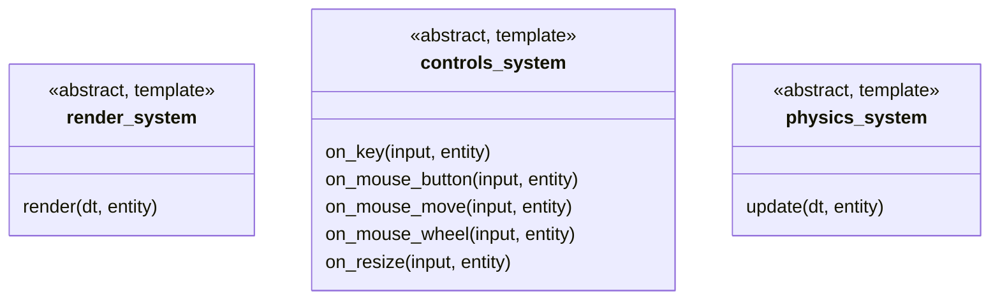
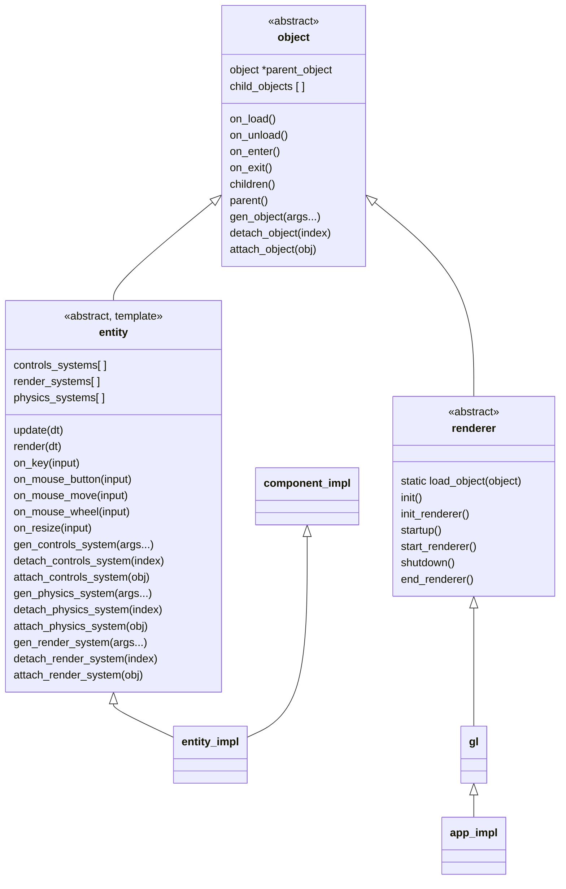

# LIT - Layer Iterator Rendering Engine (name may change)

Components:

- meshes
- sounds
- materials
- transform
- camera

Components can have just references to the same data

camera as component for scene

2. camera component, add renderable entities to render system attached to scene
